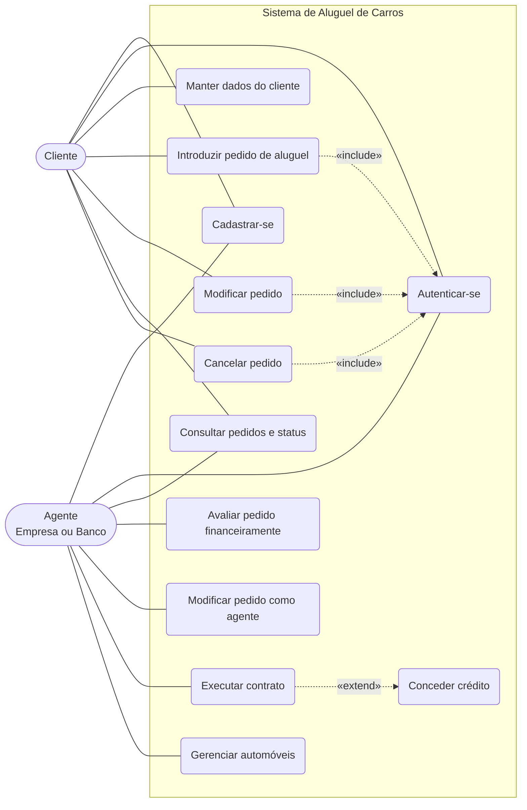

# Diagrama de Casos de Uso (v1)

```mermaid
flowchart LR
    Cliente([Cliente])
    Agente([Agente<br/>Empresa ou Banco])

    subgraph Sistema[Sistema de Aluguel de Carros]
        UC1(Cadastrar-se)
        UC2(Autenticar-se)
        UC3(Manter dados do cliente)
        UC4(Introduzir pedido de aluguel)
        UC5(Modificar pedido)
        UC6(Consultar pedidos e status)
        UC7(Cancelar pedido)
        UC8(Avaliar pedido financeiramente)
        UC9(Modificar pedido como agente)
        UC10(Executar contrato)
        UC11(Conceder crédito)
        UC12(Gerenciar automóveis)
    end

    Cliente --- UC1
    Cliente --- UC2
    Cliente --- UC3
    Cliente --- UC4
    Cliente --- UC5
    Cliente --- UC6
    Cliente --- UC7

    Agente --- UC1
    Agente --- UC2
    Agente --- UC6
    Agente --- UC8
    Agente --- UC9
    Agente --- UC10
    Agente --- UC12

    UC10 -. "«extend»" .-> UC11
    UC4 -. "«include»" .-> UC2
    UC5 -. "«include»" .-> UC2
    UC7 -. "«include»" .-> UC2
```
