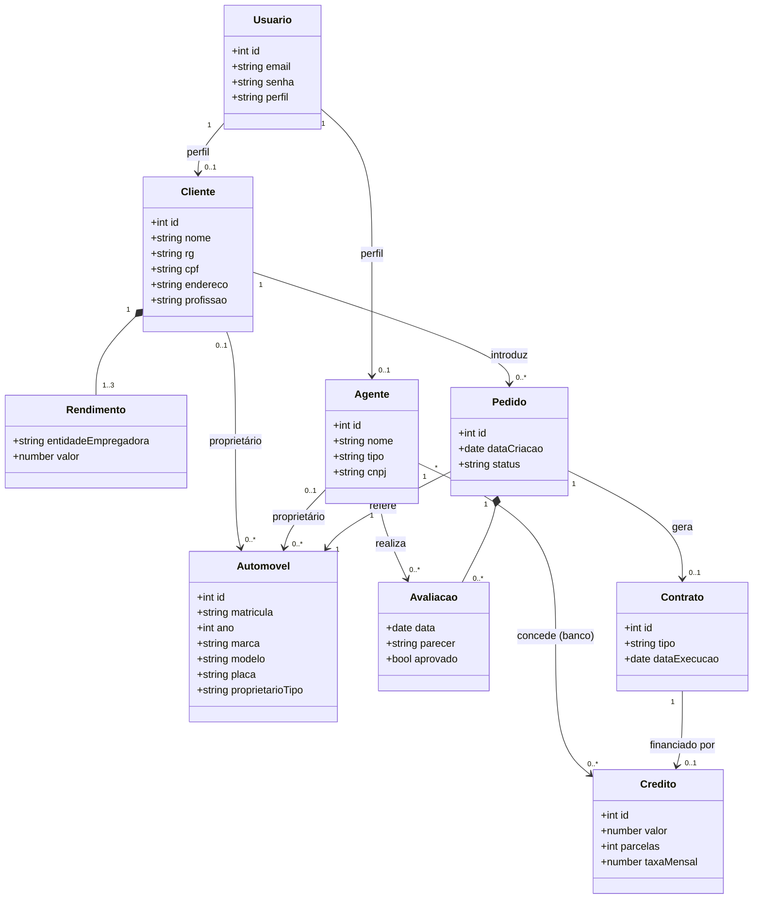

# Diagrama de Classes (v1)

```mermaid
classDiagram
    class Usuario {
        +int id
        +string email
        +string senha
        +string perfil
    }
    class Cliente {
        +int id
        +string nome
        +string rg
        +string cpf
        +string endereco
        +string profissao
    }
    class Rendimento {
        +string entidadeEmpregadora
        +number valor
    }
    class Agente {
        +int id
        +string nome
        +string tipo
        +string cnpj
    }
    class Automovel {
        +int id
        +string matricula
        +int ano
        +string marca
        +string modelo
        +string placa
        +string proprietarioTipo
    }
    class Pedido {
        +int id
        +date dataCriacao
        +string status
    }
    class Avaliacao {
        +date data
        +string parecer
        +bool aprovado
    }
    class Contrato {
        +int id
        +string tipo
        +date dataExecucao
    }
    class Credito {
        +int id
        +number valor
        +int parcelas
        +number taxaMensal
    }

    Usuario "1" --> "0..1" Cliente : perfil
    Usuario "1" --> "0..1" Agente : perfil
    Cliente "1" *-- "1..3" Rendimento
    Cliente "1" --> "0..*" Pedido : introduz
    Pedido "*" --> "1" Automovel : refere
    Pedido "1" *-- "0..*" Avaliacao
    Agente "1" --> "0..*" Avaliacao : realiza
    Pedido "1" --> "0..1" Contrato : gera
    Contrato "1" --> "0..1" Credito : financiado por
    Agente "1" --> "0..*" Credito : concede (banco)
    Agente "0..1" --> "0..*" Automovel : proprietário
    Cliente "0..1" --> "0..*" Automovel : proprietário
```
