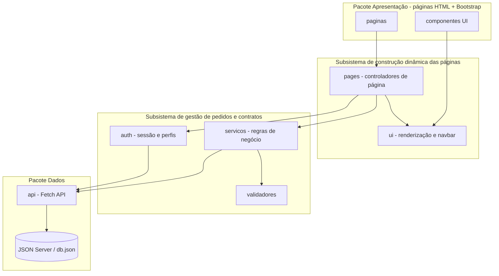

# Diagrama de Pacotes - Visão Lógica (v1)

```mermaid
flowchart TB
    subgraph Apresentacao[Pacote Apresentação - páginas HTML + Bootstrap]
        paginas[paginas]
        componentes[componentes UI]
    end
    subgraph Construcao[Subsistema de construção dinâmica das páginas]
        pages[pages - controladores de página]
        ui[ui - renderização e navbar]
    end
    subgraph Gestao[Subsistema de gestão de pedidos e contratos]
        servicos[servicos - regras de negócio]
        validadores[validadores]
        auth[auth - sessão e perfis]
    end
    subgraph Dados[Pacote Dados]
        api[api - Fetch API]
        jsonserver[(JSON Server / db.json)]
    end

    paginas --> pages
    componentes --> ui
    pages --> ui
    pages --> servicos
    pages --> auth
    servicos --> validadores
    servicos --> api
    auth --> api
    api --> jsonserver
```
