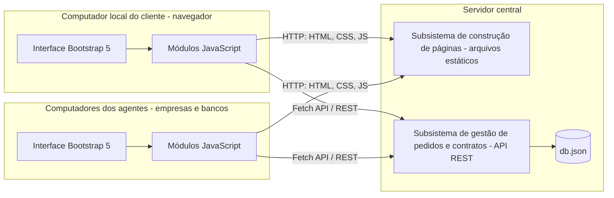

# Diagrama de Componentes (v1)

```mermaid
flowchart LR
    subgraph Cliente[Computador local do cliente - navegador]
        UIC[Interface Bootstrap 5]
        JSC[Módulos JavaScript]
    end
    subgraph Agentes[Computadores dos agentes - empresas e bancos]
        UIA[Interface Bootstrap 5]
        JSA[Módulos JavaScript]
    end
    subgraph Servidor[Servidor central]
        SP[Subsistema de construção de páginas - arquivos estáticos]
        SG[Subsistema de gestão de pedidos e contratos - API REST]
        DB[(db.json)]
    end

    UIC --> JSC
    UIA --> JSA
    JSC -- "HTTP: HTML, CSS, JS" --> SP
    JSA -- "HTTP: HTML, CSS, JS" --> SP
    JSC -- "Fetch API / REST" --> SG
    JSA -- "Fetch API / REST" --> SG
    SG --> DB
```
