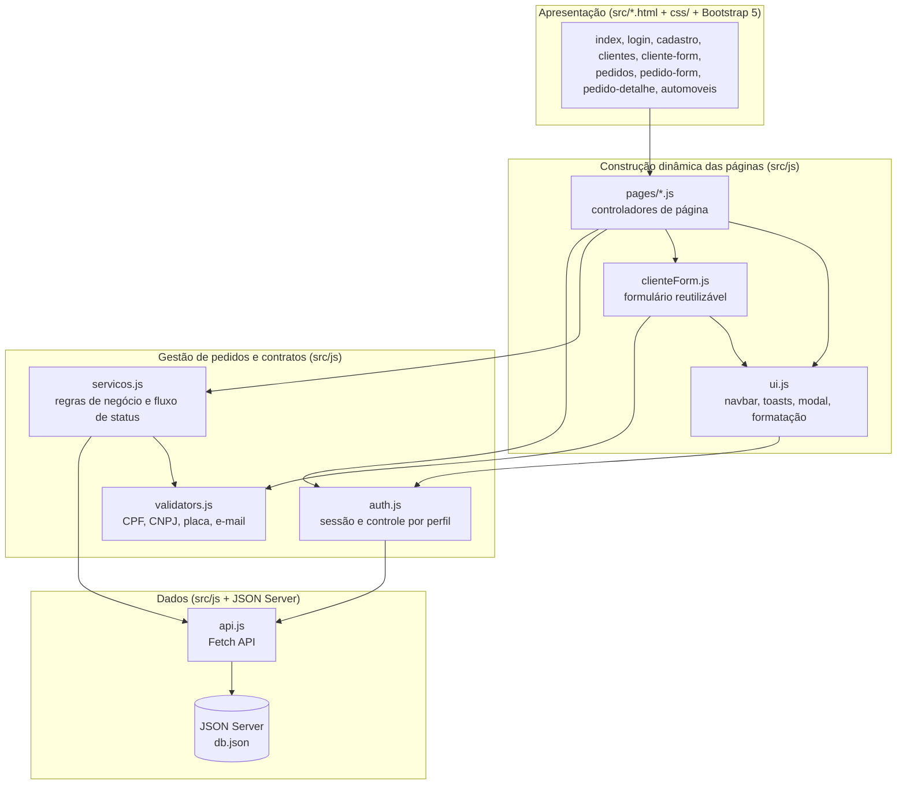

# Diagrama de Pacotes - Visão Lógica (v2 - alinhado ao código)

Cada pacote corresponde a arquivos reais em `src/`.

```mermaid
flowchart TB
    subgraph Apresentacao["Apresentação (src/*.html + css/ + Bootstrap 5)"]
        html["index, login, cadastro, clientes, cliente-form,<br/>pedidos, pedido-form, pedido-detalhe, automoveis"]
    end
    subgraph Construcao["Construção dinâmica das páginas (src/js)"]
        pages["pages/*.js<br/>controladores de página"]
        ui["ui.js<br/>navbar, toasts, modal, formatação"]
        clienteForm["clienteForm.js<br/>formulário reutilizável"]
    end
    subgraph Gestao["Gestão de pedidos e contratos (src/js)"]
        servicos["servicos.js<br/>regras de negócio e fluxo de status"]
        validators["validators.js<br/>CPF, CNPJ, placa, e-mail"]
        auth["auth.js<br/>sessão e controle por perfil"]
    end
    subgraph Dados["Dados (src/js + JSON Server)"]
        api["api.js<br/>Fetch API"]
        js[("JSON Server<br/>db.json")]
    end

    html --> pages
    pages --> ui
    pages --> clienteForm
    pages --> servicos
    pages --> auth
    clienteForm --> ui
    clienteForm --> validators
    ui --> auth
    servicos --> validators
    servicos --> api
    auth --> api
    api --> js
```
