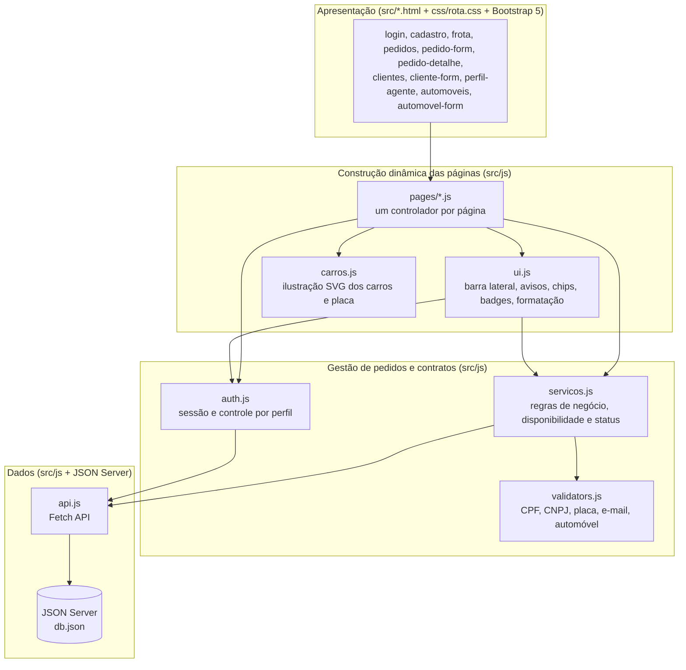

# Diagrama de Pacotes - Visão Lógica (v3 - alinhado ao código)

Cada pacote corresponde a arquivos reais em `src/`.

```mermaid
flowchart TB
    subgraph Apresentacao["Apresentação (src/*.html + css/rota.css + Bootstrap 5)"]
        html["login, cadastro, frota, pedidos, pedido-form, pedido-detalhe,<br/>clientes, cliente-form, perfil-agente, automoveis, automovel-form"]
    end
    subgraph Construcao["Construção dinâmica das páginas (src/js)"]
        pages["pages/*.js<br/>um controlador por página"]
        ui["ui.js<br/>barra lateral, avisos, chips, badges, formatação"]
        carros["carros.js<br/>ilustração SVG dos carros e placa"]
    end
    subgraph Gestao["Gestão de pedidos e contratos (src/js)"]
        servicos["servicos.js<br/>regras de negócio, disponibilidade e status"]
        validators["validators.js<br/>CPF, CNPJ, placa, e-mail, automóvel"]
        auth["auth.js<br/>sessão e controle por perfil"]
    end
    subgraph Dados["Dados (src/js + JSON Server)"]
        api["api.js<br/>Fetch API"]
        js[("JSON Server<br/>db.json")]
    end

    html --> pages
    pages --> ui
    pages --> carros
    pages --> servicos
    pages --> auth
    ui --> auth
    ui --> servicos
    servicos --> validators
    servicos --> api
    auth --> api
    api --> js
```
